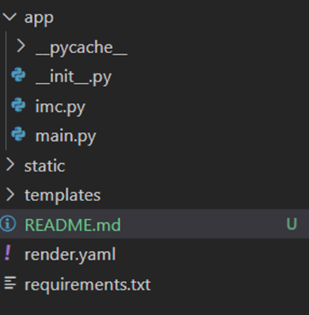

# Partage d'une application à partir de la librairie fastapi

L'application a été distribué à partir de l'hébergeur render

**Les instructions suivantes ont été réalisées pour partager l'application :**

- Arborescence à appliquer :

<>

    - Les fichiers main.py (fichier principal) et __init__.py (fichier vide) sont dans le répertoire app
    - Création d'un fichier requirements.txt à partir de l'instruction suivante dans le terminal : pip freeze > requirements.txt
    - Création d'un fichier render.yaml (en option) pour faciliter les données à saisir dans l'héberbeur render (normalement l'instruction à saisir dans la partie startCommand est : uvicorn app.main:app --host 0.0.0.0 --port 10000)

- Test du fichier en local à saisir dans le terminal : uvicorn app.main:app --reload

Date : 11/06/2025  
Editeur : Eluan T.
